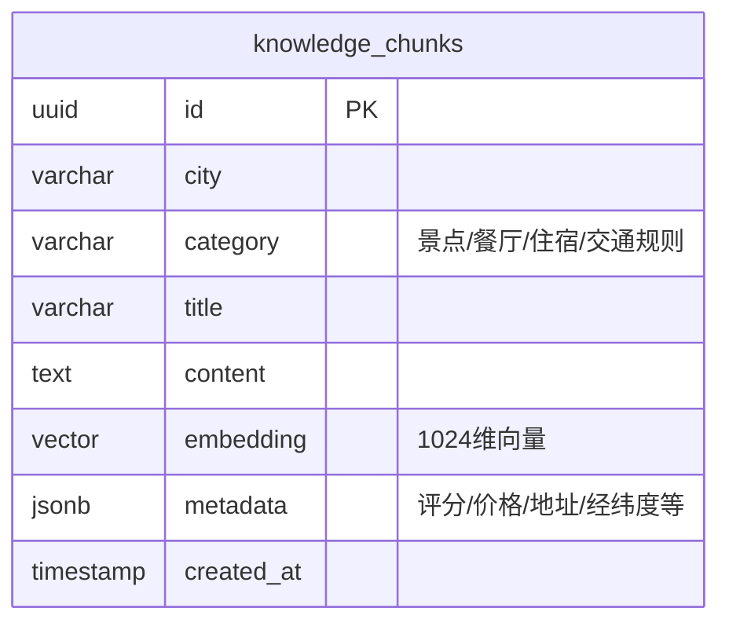

# 架构设计文档：智能 Agent 旅游助手

> **版本**：v1.0 | **日期**：2026-04-22

---

## 1. 系统架构图

```
┌──────────────────────────────────────────────────────────────┐
│                        用户浏览器                             │
│  ┌────────────────────────────────────────────────────────┐  │
│  │              Next.js 15 (App Router)                    │  │
│  │  ChatInput → Zustand Store → MessageList               │  │
│  │  ItineraryView (行程卡片) + MapView (高德地图)          │  │
│  └──────────────────────┬─────────────────────────────────┘  │
└─────────────────────────┼────────────────────────────────────┘
                          │ SSE (fetch + ReadableStream)
                          │ POST /api/v1/chat
                          ▼
┌──────────────────────────────────────────────────────────────┐
│                    FastAPI 后端 (:8000)                        │
│                                                               │
│  ┌─────────┐    ┌──────────────────────────────────────┐     │
│  │ Router  │───▶│         LangGraph Agent               │     │
│  │ (API层) │    │                                       │     │
│  └─────────┘    │  ┌─────────┐   ┌────────────────┐    │     │
│                 │  │ Planner │──▶│  Tool Executor  │    │     │
│                 │  │  Node   │   │     Node        │    │     │
│                 │  └────┬────┘   └───────┬─────────┘    │     │
│                 │       │               │               │     │
│                 │       ▼               ▼               │     │
│                 │  ┌─────────┐   ┌──────────────┐      │     │
│                 │  │Response │   │  MCP Client   │      │     │
│                 │  │Generator│   │  (工具适配)    │      │     │
│                 │  └─────────┘   └──────┬───────┘      │     │
│                 └───────────────────────┼──────────────┘     │
│                                         │                     │
│  ┌──────────────┐  ┌─────────┐         │                     │
│  │  RAG Service  │  │  Redis  │         │                     │
│  │  (检索服务)   │  │ (缓存)  │         │                     │
│  └──────┬───────┘  └─────────┘         │                     │
└─────────┼──────────────────────────────┼─────────────────────┘
          │                              │
          ▼                              ▼
┌──────────────────┐          ┌─────────────────────┐
│  PostgreSQL 16   │          │    MCP Servers       │
│  + pgvector 0.8  │          │  ┌───────────────┐  │
│  (向量知识库)     │          │  │ 高德 POI/路线  │  │
└──────────────────┘          │  │ 高德天气查询   │  │
                              │  └───────────────┘  │
                              └─────────────────────┘
```

### 调用链路

```
用户输入 → Next.js 前端
  → POST /api/v1/chat (SSE)
    → FastAPI Router
      → LangGraph StateGraph.stream()
        → Planner Node (DeepSeek-V3 推理)
          → 决定调用哪个工具
            → Tool: RAG 检索 → pgvector 查询 → 返回知识片段
            → Tool: POI 搜索 → MCP → 高德 API → 返回 POI
            → Tool: 路线规划 → MCP → 高德 API → 返回距离耗时
            → Tool: 天气查询 → MCP → 高德 API → 返回天气
          → 整合工具结果，继续推理（循环最多 10 次）
        → Response Generator (生成结构化行程 JSON)
      → SSE StreamingResponse
    → 前端流式渲染对话 + 解析行程 JSON + 地图标注
```

---

## 2. 目录结构

```
Trip_planner_FM/
│
├── backend/                          # ===== Python 后端 =====
│   ├── pyproject.toml                # uv 项目配置 + 依赖声明
│   ├── uv.lock                       # 锁定精确版本
│   │
│   ├── app/
│   │   ├── __init__.py
│   │   ├── main.py                   # FastAPI 应用入口，挂载路由
│   │   ├── config.py                 # 环境变量 / Pydantic Settings
│   │   │
│   │   ├── api/                      # API 路由层
│   │   │   ├── __init__.py
│   │   │   ├── router.py             # 路由注册
│   │   │   ├── chat.py               # POST /api/v1/chat（核心）
│   │   │   ├── itinerary.py          # GET /api/v1/itinerary/{id}
│   │   │   └── health.py             # GET /api/v1/health
│   │   │
│   │   ├── agent/                    # Agent 核心逻辑
│   │   │   ├── __init__.py
│   │   │   ├── graph.py              # LangGraph 状态图定义
│   │   │   ├── state.py              # AgentState 类型定义
│   │   │   ├── nodes.py              # 各节点函数（planner/tool/response）
│   │   │   └── prompts.py            # System Prompt 模板
│   │   │
│   │   ├── tools/                    # 工具定义
│   │   │   ├── __init__.py
│   │   │   ├── mcp_client.py         # MCP 客户端管理
│   │   │   ├── rag_search.py         # RAG 向量检索工具
│   │   │   ├── poi_search.py         # 高德 POI 搜索（降级方案）
│   │   │   ├── route_plan.py         # 高德路线规划（降级方案）
│   │   │   └── weather.py            # 天气查询（降级方案）
│   │   │
│   │   ├── rag/                      # RAG 相关
│   │   │   ├── __init__.py
│   │   │   ├── embeddings.py         # Embedding 模型加载
│   │   │   ├── vectorstore.py        # pgvector 连接与检索
│   │   │   └── ingest.py             # 数据入库脚本
│   │   │
│   │   ├── models/                   # 数据模型
│   │   │   ├── __init__.py
│   │   │   ├── schemas.py            # Pydantic 请求/响应模型
│   │   │   └── db_models.py          # SQLAlchemy ORM 模型
│   │   │
│   │   ├── services/                 # 业务服务层
│   │   │   ├── __init__.py
│   │   │   ├── session.py            # 会话管理（Redis）
│   │   │   └── cache.py              # 缓存服务（Redis）
│   │   │
│   │   └── db/                       # 数据库
│   │       ├── __init__.py
│   │       ├── connection.py         # 数据库连接池
│   │       └── migrations/           # 数据库迁移脚本
│   │
│   ├── data/                         # 知识库原始数据
│   │   ├── beijing.json
│   │   ├── shanghai.json
│   │   └── chengdu.json
│   │
│   ├── tests/
│   │   ├── test_agent.py
│   │   ├── test_api.py
│   │   └── test_tools.py
│   │
│   └── Dockerfile
│
├── frontend/                         # ===== Next.js 前端 =====
│   ├── package.json
│   ├── pnpm-lock.yaml
│   ├── next.config.ts
│   ├── tailwind.config.ts
│   ├── components.json               # shadcn/ui 配置
│   │
│   ├── src/
│   │   ├── app/                      # App Router 页面
│   │   │   ├── layout.tsx            # 根布局
│   │   │   ├── page.tsx              # 落地页 /
│   │   │   └── chat/
│   │   │       └── page.tsx          # 对话页 /chat
│   │   │
│   │   ├── components/
│   │   │   ├── ui/                   # shadcn/ui 组件
│   │   │   ├── chat/                 # 对话组件
│   │   │   ├── itinerary/            # 行程组件
│   │   │   ├── map/                  # 地图组件
│   │   │   └── layout/               # 布局组件
│   │   │
│   │   ├── hooks/                    # useChat, useItinerary, useAMap
│   │   ├── store/                    # Zustand store
│   │   ├── lib/                      # API 封装、SSE、工具函数
│   │   └── types/                    # TypeScript 类型
│   │
│   └── Dockerfile
│
├── docker-compose.yml                # 服务编排
├── .env.example                      # 环境变量模板
├── PRD.md
├── TECH-STACK.md
├── PROJECT-SCOPE.md
├── frontend-design.md
├── ARCHITECTURE.md                   # 本文档
└── README.md
```

---

## 3. 模块划分

### 模块依赖关系

```
api (路由层)
 └──▶ agent (Agent 核心)
       ├──▶ tools (工具集)
       │     ├──▶ mcp_client (MCP 协议)
       │     └──▶ rag (向量检索)
       │           └──▶ db (数据库连接)
       └──▶ services (会话/缓存)
             └──▶ Redis
```

### 各模块定义

| 模块 | 职责 | 入参 | 出参 | 依赖 |
|------|------|------|------|------|
| **api.chat** | 接收用户消息，返回 SSE 流 | `ChatRequest(message, session_id)` | `SSE stream(event, data)` | agent |
| **agent.graph** | 编排 ReAct 状态机 | `AgentState(messages, profile, itinerary)` | `AgentState（更新后）` | nodes, state |
| **agent.nodes** | 各节点执行逻辑 | `AgentState` | `AgentState patch` | tools, llm |
| **tools.mcp_client** | MCP 工具注册与调用 | 工具名 + 参数 | 工具返回 JSON | langchain-mcp-adapters |
| **tools.rag_search** | 向量检索旅游知识 | `query: str, city: str, top_k: int` | `list[Document]` | rag.vectorstore |
| **rag.vectorstore** | pgvector 连接与查询 | `embedding: list[float], filter: dict` | `list[Document]` | db.connection |
| **rag.ingest** | 原始数据切片入库 | JSON 文件路径 | 入库条数 | embeddings, vectorstore |
| **services.session** | 会话上下文读写 | `session_id: str` | `SessionData` | Redis |
| **services.cache** | 工具结果缓存 | `cache_key: str` | `cached_value or None` | Redis |

---

## 4. 数据库设计

### 4.1 ER 图



> [!NOTE]
> 本系统数据库仅包含 **RAG 知识库** 一张核心表。会话数据存 Redis，行程数据存前端 Zustand，不做持久化（参见 PROJECT-SCOPE.md）。

### 4.2 核心表结构

**knowledge_chunks**（旅游知识切片表）

```sql
CREATE EXTENSION IF NOT EXISTS vector;

CREATE TABLE knowledge_chunks (
    id            UUID PRIMARY KEY DEFAULT gen_random_uuid(),
    city          VARCHAR(50)  NOT NULL,          -- 所属城市
    category      VARCHAR(20)  NOT NULL,          -- 景点/餐厅/住宿/规则
    title         VARCHAR(200) NOT NULL,          -- 名称
    content       TEXT         NOT NULL,          -- 详细描述
    embedding     VECTOR(1024) NOT NULL,          -- bge-large-zh 向量
    metadata      JSONB        DEFAULT '{}',      -- 扩展字段
    created_at    TIMESTAMPTZ  DEFAULT NOW()
);

-- 向量索引（IVFFlat，适合中小规模数据）
CREATE INDEX idx_chunks_embedding
    ON knowledge_chunks USING ivfflat (embedding vector_cosine_ops)
    WITH (lists = 20);

-- 城市 + 类别联合索引（关键词过滤）
CREATE INDEX idx_chunks_city_category
    ON knowledge_chunks (city, category);
```

**metadata JSONB 示例**：

```json
{
  "address": "北京市东城区景山前街4号",
  "lng": 116.397,
  "lat": 39.918,
  "rating": 4.8,
  "price_range": "60元/人",
  "opening_hours": "08:30-17:00",
  "tags": ["历史", "世界遗产", "必去"]
}
```

---

## 5. API 接口设计

### 5.1 接口总览

| 方法 | 路径 | 说明 | 优先级 |
|------|------|------|--------|
| `POST` | `/api/v1/chat` | 发送消息，返回 SSE 流 | P0 |
| `GET` | `/api/v1/session/{id}` | 获取会话上下文 | P1 |
| `DELETE` | `/api/v1/session/{id}` | 清除会话 | P2 |
| `GET` | `/api/v1/health` | 健康检查 | P0 |

### 5.2 核心接口详情

#### POST /api/v1/chat

对话接口，返回 SSE 流。

**请求体**：
```json
{
  "message": "我想去北京玩3天，预算3000元",
  "session_id": "uuid-xxx"
}
```

**响应**：`Content-Type: text/event-stream`

```
event: thinking
data: {"step": "正在分析您的需求..."}

event: tool_call
data: {"tool": "poi_search", "args": {"city": "北京", "keyword": "历史文化景点"}}

event: tool_result
data: {"tool": "poi_search", "result": [{...}]}

event: content
data: {"text": "根据您的需求，我为您规划了以下"}

event: content
data: {"text": "北京3天行程：\n\n## 第一天..."}

event: itinerary
data: {"itinerary": {"days": [...], "total_cost": 2850}}

event: done
data: {}
```

**SSE 事件类型**：

| event | data 结构 | 说明 |
|-------|----------|------|
| `thinking` | `{step: string}` | Agent 推理状态提示 |
| `tool_call` | `{tool: string, args: object}` | 工具调用开始 |
| `tool_result` | `{tool: string, result: object}` | 工具调用结果 |
| `content` | `{text: string}` | 流式文本片段 |
| `itinerary` | `{itinerary: Itinerary}` | 结构化行程 JSON |
| `error` | `{message: string}` | 错误信息 |
| `done` | `{}` | 流结束 |

**状态码**：

| 状态码 | 说明 |
|--------|------|
| 200 | SSE 流正常开始 |
| 400 | 请求体校验失败（message 为空等） |
| 429 | 请求过于频繁（限流） |
| 500 | 后端异常 |
| 503 | LLM API 不可用 |

#### GET /api/v1/session/{id}

```json
// 响应 200
{
  "session_id": "uuid-xxx",
  "profile": {
    "destination": "北京",
    "days": 3,
    "budget": 3000,
    "style": "历史文化",
    "diet_preference": "不吃辣"
  },
  "message_count": 4,
  "created_at": "2026-04-22T10:00:00Z"
}
```

#### GET /api/v1/health

```json
// 响应 200
{
  "status": "ok",
  "services": {
    "database": "connected",
    "redis": "connected",
    "llm": "reachable"
  }
}
```

---

## 6. Agent 状态机设计

### 6.1 状态定义

```python
# agent/state.py（伪代码）
from typing import TypedDict, Annotated
from langgraph.graph.message import add_messages

class AgentState(TypedDict):
    messages: Annotated[list, add_messages]  # 对话历史
    user_profile: dict | None               # 用户画像
    itinerary: dict | None                  # 当前行程 JSON
    iteration_count: int                    # ReAct 迭代计数
    should_end: bool                        # 是否终止循环
```

### 6.2 状态图

```
                    ┌──────────────┐
                    │   START      │
                    └──────┬───────┘
                           │
                           ▼
                 ┌─────────────────┐
          ┌─────▶│  planner_node   │◀────────────┐
          │      │  (LLM 推理)     │             │
          │      └────────┬────────┘             │
          │               │                      │
          │        LLM 返回内容                   │
          │               │                      │
          │      ┌────────▼─────────┐            │
          │      │  route_decision  │            │
          │      │  (条件路由)       │            │
          │      └──┬─────┬────┬───┘            │
          │         │     │    │                 │
          │    有工具调用  │  无工具调用           │
          │         │     │    │                 │
          │         ▼     │    ▼                 │
          │  ┌──────────┐ │ ┌────────────────┐  │
          │  │tool_node │ │ │ response_node  │  │
          │  │(执行工具) │ │ │ (生成最终回复)  │  │
          │  └────┬─────┘ │ └───────┬────────┘  │
          │       │       │         │            │
          │       │       │         ▼            │
          └───────┘       │      ┌──────┐       │
                          │      │ END  │       │
              迭代超限 ────┘      └──────┘       │
              (iteration > 10)                   │
                    │                            │
                    ▼                            │
            ┌──────────────┐                     │
            │ fallback_node│─────────────────────┘
            │ (返回当前结果)│     (带已有结果回到 planner
            └──────────────┘      生成部分行程)
```

### 6.3 节点定义

| 节点 | 函数 | 职责 | 绑定工具 |
|------|------|------|----------|
| `planner_node` | `run_planner()` | 调用 LLM 进行 ReAct 推理 | 所有工具（LLM 自主选择） |
| `tool_node` | `run_tools()` | 执行 LLM 选择的工具 | rag_search, poi_search, route_plan, weather_query |
| `response_node` | `generate_response()` | 整理最终回复 + 结构化行程 | 无 |
| `fallback_node` | `handle_fallback()` | 迭代超限时的兜底 | 无 |

### 6.4 条件路由逻辑

```python
# agent/graph.py（伪代码）
def route_decision(state: AgentState) -> str:
    last_message = state["messages"][-1]

    # 超过最大迭代次数 → 兜底
    if state["iteration_count"] >= 10:
        return "fallback_node"

    # LLM 返回了工具调用 → 执行工具
    if hasattr(last_message, "tool_calls") and last_message.tool_calls:
        return "tool_node"

    # LLM 返回了纯文本 → 生成最终响应
    return "response_node"
```

### 6.5 工具注册

```python
# agent/graph.py（伪代码）
from langchain_mcp_adapters.client import MultiServerMCPClient
from app.tools.rag_search import rag_search_tool

async def build_graph():
    # 1. 加载 MCP 工具
    mcp_client = MultiServerMCPClient({
        "amap": {
            "command": "npx",
            "args": ["-y", "@amap/amap-mcp-server"],
            "env": {"AMAP_API_KEY": settings.AMAP_API_KEY}
        }
    })
    mcp_tools = await mcp_client.get_tools()

    # 2. 加 RAG 检索工具
    all_tools = mcp_tools + [rag_search_tool]

    # 3. 绑定到 LLM
    llm_with_tools = llm.bind_tools(all_tools)

    # 4. 构建状态图
    graph = StateGraph(AgentState)
    graph.add_node("planner_node", run_planner)
    graph.add_node("tool_node", ToolNode(all_tools))
    graph.add_node("response_node", generate_response)
    graph.add_node("fallback_node", handle_fallback)

    graph.set_entry_point("planner_node")
    graph.add_conditional_edges("planner_node", route_decision)
    graph.add_edge("tool_node", "planner_node")
    graph.add_edge("response_node", END)
    graph.add_edge("fallback_node", "response_node")

    return graph.compile()
```

---

## 7. 部署架构

### 7.1 Docker Compose

```yaml
version: "3.9"

services:
  # ---- 前端 ----
  frontend:
    build: ./frontend
    ports:
      - "3000:3000"
    environment:
      - NEXT_PUBLIC_API_URL=http://backend:8000
      - NEXT_PUBLIC_AMAP_KEY=${AMAP_JS_KEY}
      - NEXT_PUBLIC_AMAP_SECRET=${AMAP_JS_SECRET}
    depends_on:
      - backend

  # ---- 后端 ----
  backend:
    build: ./backend
    ports:
      - "8000:8000"
    environment:
      - DEEPSEEK_API_KEY=${DEEPSEEK_API_KEY}
      - DEEPSEEK_BASE_URL=https://api.deepseek.com
      - POSTGRES_HOST=postgres
      - POSTGRES_PORT=5432
      - POSTGRES_DB=trip_planner
      - POSTGRES_USER=postgres
      - POSTGRES_PASSWORD=${POSTGRES_PASSWORD}
      - REDIS_HOST=redis
      - REDIS_PORT=6379
      - AMAP_API_KEY=${AMAP_API_KEY}
    depends_on:
      postgres:
        condition: service_healthy
      redis:
        condition: service_started

  # ---- 数据库 ----
  postgres:
    image: pgvector/pgvector:pg16
    ports:
      - "5432:5432"
    environment:
      - POSTGRES_DB=trip_planner
      - POSTGRES_USER=postgres
      - POSTGRES_PASSWORD=${POSTGRES_PASSWORD}
    volumes:
      - pgdata:/var/lib/postgresql/data
    healthcheck:
      test: ["CMD-SHELL", "pg_isready -U postgres"]
      interval: 5s
      retries: 5

  # ---- 缓存 ----
  redis:
    image: redis:7-alpine
    ports:
      - "6379:6379"
    volumes:
      - redisdata:/data

volumes:
  pgdata:
  redisdata:
```

### 7.2 端口映射

| 服务 | 容器端口 | 宿主端口 | 访问地址 |
|------|----------|----------|----------|
| frontend | 3000 | 3000 | http://localhost:3000 |
| backend | 8000 | 8000 | http://localhost:8000 |
| postgres | 5432 | 5432 | localhost:5432 |
| redis | 6379 | 6379 | localhost:6379 |

### 7.3 启动命令

```bash
# 开发环境：各服务独立启动
cd backend  && uv run uvicorn app.main:app --reload --port 8000
cd frontend && pnpm dev

# 生产/演示环境：一键启动
docker-compose up -d

# 初始化知识库（首次部署后执行）
docker-compose exec backend uv run python -m app.rag.ingest
```
